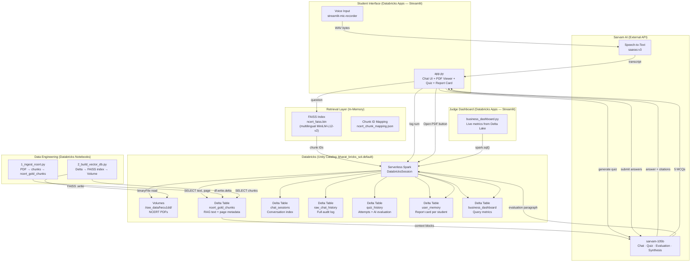

# Vidyarthi-AI — NCERT Tutor on Databricks

**Vidyarthi-AI** is a multilingual RAG-powered tutoring app for Indian students (Class 8–10 NCERT Science) that answers questions in Hindi, English, or Urdu, generates adaptive quizzes, and maintains a persistent AI report card — all running natively on Databricks Apps with Delta Lake as the single source of truth.

---

## Architecture



### Component Summary

| Layer | Technology | Purpose |
|---|---|---|
| **App Hosting** | Databricks Apps | Serves both Streamlit apps without external infra |
| **Compute** | Databricks Serverless Spark | All Delta Lake reads/writes, Volume file access |
| **Data Store** | Delta Lake (6 tables) | Chat history, sessions, quiz results, report cards, metrics |
| **File Storage** | Databricks Volumes | NCERT PDFs, FAISS index, chunk mapping JSON |
| **Vector Search** | FAISS + MiniLM-L12-v2 | Multilingual semantic search over NCERT chunks |
| **LLM** | Sarvam-105B | Answering, quiz generation, evaluation, synthesis |
| **STT** | Sarvam AI saaras:v3 | Voice question transcription |
| **Governance** | Unity Catalog | All tables under `bharat_bricks_sol.default.*` |

---

## Delta Lake Schema

```sql
-- Run data_engineering/database_setup.sql in Databricks SQL Editor
USE CATALOG bharat_bricks_sol;
USE SCHEMA default;

-- Core RAG dataset (populated by 1_ingest_ncert.py)
ncert_gold_chunks  (chunk_id, class_level, language, chapter, page_number, text_content)

-- Student state
chat_sessions      (session_id, user_id, title, created_at, updated_at)
raw_chat_history   (session_id, user_id, prompt, raw_response, timestamp)
quiz_history       (quiz_id, session_id, user_id, questions, user_answers, correct_answers, score, total, strong_point, weak_point, created_at)
user_memory        (user_id, class_level, proficiency, strong_points, weak_points)

-- Analytics
business_dashboard (log_id, metric_name, metric_value, timestamp)
```

---

## How to Run

### Prerequisites
- Databricks workspace with Unity Catalog enabled
- Sarvam AI API key
- Python 3.10+

### 1. Set up Delta Lake tables
```sql
-- In Databricks SQL Editor, paste and run:
data_engineering/database_setup.sql
```

### 2. Ingest NCERT PDFs
```python
# In a Databricks Notebook cell, paste and run:
# data_engineering/1_ingest_ncert.py
# (uploads chunks from /Volumes/bharat_bricks_sol/default/raw_data/ → ncert_gold_chunks)
```

### 3. Build the FAISS vector index
```python
# In a new Databricks Notebook cell, paste and run:
# data_engineering/2_build_vector_db.py
# (reads ncert_gold_chunks → builds FAISS → saves to Volume)
```

### 4. Deploy the tutor app
```bash
# Sync local files to Databricks workspace
databricks sync --watch . /Workspace/Users/<your-email>/databricks_apps/vidhyarthi-ai/

# In Databricks UI: Compute → Apps → Create App → Streamlit
# Entry point: app.py
# Source: /Workspace/Users/<your-email>/databricks_apps/vidhyarthi-ai/
```

### 5. Deploy the judge dashboard
```bash
# In Databricks UI: Compute → Apps → Create App → Streamlit
# Entry point: business_dashboard.py
# Source: same workspace folder as above
```

### 6. Run locally (optional, for development)
```bash
pip install -r requirements.txt
export DATABRICKS_HOST=https://<your-workspace>.cloud.databricks.com
export DATABRICKS_TOKEN=<your-pat>
streamlit run app.py
```

---

## Demo Steps

### Tutor App (`app.py`)

**Step 1 — Ask a question**
> Type in the chat box: `What are microorganisms and how do they affect us?`

Watch: the app searches NCERT Delta Lake, calls Sarvam-105B, and returns a cited answer with expandable **Sources** showing chapter and page number.

**Step 2 — Open a cited PDF**
> Click **Open PDF** on any source card under the answer.

Watch: the exact cited page renders inline as a high-res image pulled from Databricks Volumes.

**Step 3 — Try voice input**
> Click **Record question** in the sidebar, ask "Bharat mein kaun se microorganisms hain?", click Stop.

Watch: Sarvam AI transcribes the Hindi question and auto-submits it. The answer comes back in Hindi.

**Step 4 — Generate an adaptive quiz**
> Scroll down to **Adaptive Quiz**, click **Generate Quiz Now**.

Watch: 5 MCQs appear based on your conversation topics. Select answers and click **Submit Quiz for Evaluation**.

**Step 5 — View your Report Card**
> Expand **My Report Card**, click **Generate Comprehensive Session Report**.

Watch: all quiz evaluations from this session are synthesized by Sarvam-105B into a master paragraph, which is written to `user_memory` in Delta Lake.

**Step 6 — Resume a previous chat**
> Click any session in the **Chat History** sidebar.

Watch: the full conversation is loaded from `raw_chat_history` in Delta Lake — no in-memory state required.

---

### Judge Dashboard (`business_dashboard.py`)

> Open the dashboard app URL, click **Refresh Live Metrics**.

Watch: live counts of total student queries and unique students tracked are pulled directly from `business_dashboard` and `user_memory` Delta tables.

---

## Data Flow Summary

```
Student question
  → [FAISS semantic search] → top-5 NCERT chunk IDs
  → [Delta Lake: ncert_gold_chunks] → text + page metadata
  → [Sarvam-105B] → grounded answer in student's language
  → [Delta Lake: raw_chat_history + chat_sessions + business_dashboard] → persisted

Quiz submission
  → [Sarvam-105B] → AI evaluation paragraph
  → [Delta Lake: quiz_history + user_memory] → persisted report card

Report card synthesis
  → [All quiz_history for session] → [Sarvam-105B] → master paragraph
  → [Delta Lake: user_memory] → single row per student, always current
```

---

## Repository Structure

```
bharat_bricks/
├── app.py                          # Main tutor Streamlit app (Databricks Apps entry)
├── business_dashboard.py           # Judge analytics dashboard
├── requirements.txt                # Python dependencies
├── ncert_faiss.bin                 # FAISS vector index (synced to workspace)
├── ncert_chunk_mapping.json        # FAISS index → chunk_id mapping
├── src/
│   ├── llm_engine.py               # VidyarthiAgent: RAG orchestration + Sarvam API calls
│   ├── retrieval.py                # VidyarthiRetriever: FAISS search + Delta Lake fetch
│   └── async_memory_updater.py     # All Delta Lake read/write operations
├── data_engineering/
│   ├── database_setup.sql          # Creates all 6 Delta Lake tables
│   ├── 1_ingest_ncert.py           # PDF → chunks → ncert_gold_chunks (run in Notebook)
│   ├── 2_build_vector_db.py        # Delta → FAISS index → Volume (run in Notebook)
│   └── clear_dynamic_data.sql      # Truncates session/quiz tables (reset for demo)
└── raw_data/
    └── hecu1dd/                    # NCERT Class 8 Science PDFs (hecu101.pdf … hecu113.pdf)
```
